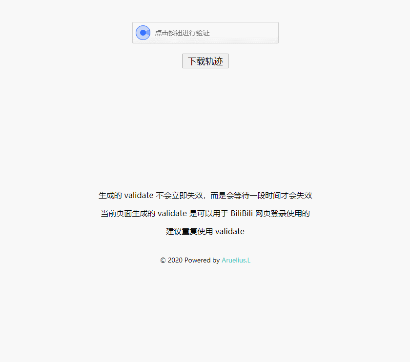

# 极验滑动轨迹获取
本项目能够让你收集自己滑动的轨迹，收集到的轨迹文件，可以直接被 Python 的 json 模块序列化，从而应用于你的项目。
## 演示
 
## 使用
1. Python 版本 >= 3.7
2. 安装依赖  
~~~shell
pip install -r requirements.txt
~~~
3. 运行服务  
~~~shell
python run.py
~~~
4. 打开 **<http://127.0.0.1:5000/>** ，滑动滑块并且下载轨迹。  
5. 建议滑动一百次以上。  

## 轨迹适用范围
所有极验滑动验证码  

## 轨迹解析
每次滑动，都会生成如下的轨迹列表  
~~~python
[[-31,-30,0], [0,0,0], [2,2,3], [5,3,15], [7,4,19], [11,5,31], [14,7,34], [18,7,47], [23,7,50], [27,7,58], [31,7,66], [35,7,75], [41,7,83], [42,7,91], [47,7,98], [51,7,107], [55,7,114], [58,7,123], [62,7,130], [65,7,138], [67,7,149], [71,7,154], [72,7,163], [73,7,170], [75,7,180], [76,7,186], [79,7,196], [82,6,202], [86,5,212], [89,5,218], [91,5,230], [95,5,235], [96,5,247], [99,5,250], [100,5,259], [101,5,266], [103,5,275], [105,5,282], [108,5,291], [111,5,298], [115,5,307], [118,5,314], [121,5,323], [124,5,330], [125,5,339], [126,5,346], [128,5,355], [129,5,370], [132,5,380], [133,5,387], [134,5,403], [136,5,414], [138,5,419], [140,5,435], [141,5,448], [142,5,459], [144,5,515], [145,5,525], [146,5,538], [146,5,747]]
~~~
每一个小列表，都代表一次细微的停顿。整个列表代表这次滑动滑块所产生的的轨迹。  
其中，每一个小列表的组成如下：  
~~~python
[x, y, time]
~~~
+ x 代表每次滑动细微停顿所在的坐标，相对于验证码图片的左边，最后的 x 即为图片缺口所在坐标。  
+ y 代表鼠标在滑块上的坐标，中心为滑块。  
+ time 代表每次细微停顿所消耗的时间，最后的 time 即为整次滑动所消耗的时间。  

>其中，y 坐标可以随意取值，x 坐标和 time 需要自写算法生成，或手动抓取。  

## 轨迹可视化

将轨迹中的 x 坐标拿出来，选取部分有意义的轨迹，生成折线图

## 自定义
获取 `gt`，`challenge` 的方法在 `run.py` 文件里，函数名为：`get_pc_captcha`  